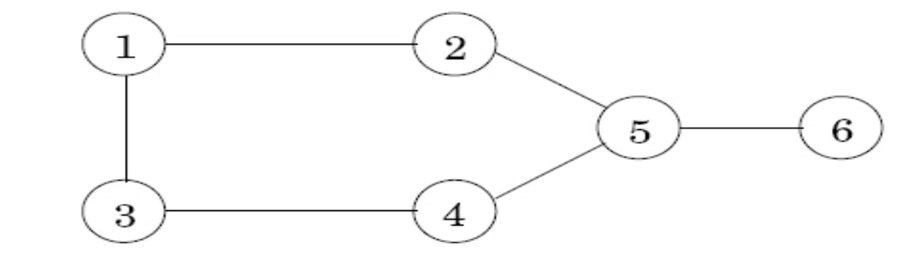

# Week 6, Lecture 12 on 29 September 2021 CS1.301.M21 Algorithm Analysis and Design

## DP Review

* Shortest paths in DAGs
* Longest increasing subsequence
* Edit Distance
* Chain Matrix Multiplication
* Knapsack - NP Hard but in some cases (fractional) can be solved even with a Greedy solution.


> Coming up with the subproblems is the key step in Dynamic Programming problems


## Shortest Reliable Paths

### The Problem

Given a graph $G$ with lengths for each edge, along with two nodes $s$ and $t$ and an integer $k$, we want the shortest path from $s$ to $t$ that uses at most $k$ edges (a *reliable* path).

### The Answer

>Since identifying the sub problems for the DP approach is  the difficult part, once the subproblems are identified we can consider the problem solved

$i< k , \text{dist}(v,i)$ is the length of the shortest path from $s$ to $v$ that uses $i$ edges.

We get
$$
\text{dist}(v,i) = \min_{(u,v)\in E}\{\text{dist}(u, i-1)+l(u,v)\}
$$
Solving `dist(v,k)` will give the final answer of the problem.

> The dynamic programming approach is great. But finding a greedy solution is always better.

Recursion with memoization is fine. But technically DP is the iteration of a recursion with memoization.

## All-pairs Shortest Paths

### The Problem

Find the shortest path between all the pairs of nodes in a given graph

### The Answer

We can run *Dijkstra's Algorithm* for the shortest pair for a given pair of nodes, for all pairs of nodes. that will be $O(|V|^2|E|)$

The *Floyd-Warshall Algorithm* calculates exactly this in $O(|V|^3)$

> Does Floyd-Warshall Algorithm work for negative edge weights, given that there are no negative cycles?

Let $\text{dist}(i,j,k)$ denote the length of shortest path from i to j in which only nodes $\{1,2,...,k\}$ can be used.

$\text{dist}(i,j,k)$ can be defined as:
$$
\text{dist}(i,j,k) = \min \{\text{dist}(i,k,k-1) + \text{dist}(k,j,k-1), \text{dist}(i,j,k-1)\}
$$
It turns out that a node $k$ either is present in a shortest path or not. For it to be present we need the path going through it to be a shorter path than without it. This is calculated with the $\min$ function.

 The algorithm becomes:

```
for all (i,j):
	initialise dist(i,j,0) = l(i,j)

for all k:
	for all i:
		for all j:
			dist(i,j,k) = min{dist(i,k,k-1) + dist(k,j,k-1), dist(i,j,k-1)}
```


> Dynamic programming is characterized by the optimum sub structure property. But the speed lent to the paradigm comes only when used on problems that have a large amount of overlap in the subproblems.

 

## Independent Set in Trees

### The Problem

> The problem is NP hard for non-tree cases

An independent set is a subset of nodes that have no edges between them. 

For example, and independent set in this graph can be $\{1,4,6\}$ and is, in fact, of the largest size possible.




Though the shown example is graph, the problem for us is to find the size of the largest independent set in a given **tree**.

### The Answer

The largest independent set of a tree should be made of the largest independent set of its subtrees.

Let $I(u)$ be the size of the largest independent set hanging from the node $u$.

This is the subproblem. And the base case is $I(\text{any leaf}) = 1$ 

To compute $I(u)$ we use:
$$
I(u) = \max \{1+\sum_{\text{grandchildren w of u}}I(w), \sum_{\text{children w of u}}I(w)\}
$$
We compute $I(u)$ in a BFS manner starting from any node. And the final $I(u)$ will be the final answer.

***

