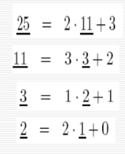

# Week 6, Lecture 13 on 9 October 2021 - CS1.301.M21 Algorithm Analysis and Design

## Euclid's Algorithm for GCD

### The Problem

Find the Greatest Common Divisor of two integers $a$ and $b$

### The Answer

The school method of doing this is prime factorization but this is not in $P$

Instead we use the following algorithm (given that $a>b$):

```
Euclid(a,b):
	if b == 0: return a
	return Euclid(b, a mod b)
```

This works since $b$ is always greater than $a ~ \text{mod}~ b$

The crux of this solution is that $\gcd(x,y) = \gcd(y, x \mod y)$:

Given a divisor $d$ of $x$ and $y$, it divides $x-y$ since we can rewrite it as $k_1 d - k_2 d$.

Now suppose we take $k_1 d - c \times k_2 d$ for any integer $c$. This is also true since $k_2$ could be any constant. So we can also say that $\gcd (a,b) = \gcd (b, a \mod b)$ where $k_2$ becomes the largest value that divides $a$.

### Analysis

> we could do an analysis by saying that the worst case is two consecutive Fibonacci  series numbers and analyzing that case.

It suffices to show that $a \mod b < a/2$ since if $b<a/2$ then we can fit at least 2 $b$s in $a$ and otherwise only one $b$ fits in $a$.

So we can say that in each recursion we have a halving of $a$ hence the algorithm will complete in $O(\log a)$.

## Extended Euclid Algorithm

### The Problem

If $d$ is a divisor of $a$ and $b$, and $d = ax + by$ then $d$ is necessarily the GCD of the two numbers. 

$\gcd(a,b) \geq d$ since $d$ is a divisor and therefore less than or equal to the GCD. 

The GCD of $a$ and $b$ also divides  $d = ax + by$ since it is a divisor and so $\gcd(a,b) \leq d$ so therefore we know that $d = \gcd(a,b)$.

The problem now is **to compute** the above shown $x$ and $y$.

### The Answer

Consider the following run of the Euclid Algorithm:



$25 = 2 \cdot 11 + 3$ so it follows $25 + 2 \cdot 11 = 3$ and we can say this about each of the remainders obtained in Euclid's Algorithm.

```
ExtendedEuclid(a,b):
	if b == 0: return (1,0,a)
	(x,y,d) = ExtendedEuclid(b,a mod b)
	return (y, x - floor(a/b) y, d)
```


**Proof:**

Now writing $(a \mod b)$ as $(a - \lfloor a/b \rfloor b)$ we get, 
$$
\gcd(b, a \mod b) = b x' + (a \mod b) y' = b x' + (a - \lfloor a/b \rfloor b) y' = ay' + b(x' - \lfloor a/b \rfloor y')
$$

## Modular Division

$x$ is the multiplicative inverse of $a \mod n$ if  $ax \equiv 1 (\mod N)$.

### Modular division theorem

For any $a \mod N$ , $a$ has a multiplicative inverse modulo $N$ if and only if it is relatively prime to $N$. When this inverse exists, it can be found in time $O(n^3)$ (where as usual n denotes the number of bits of $N$) by running the extended Euclid algorithm.
