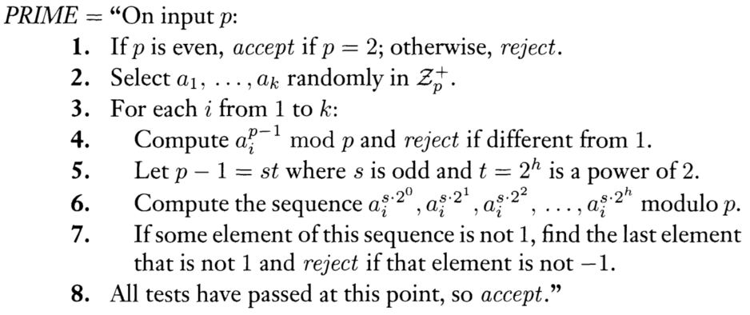

# Week 9, Lecture 14 on 13 October 2021 - CS1.301.M21 Algorithm Analysis and Design

## Randomized Algorithms

These algorithms are based on randomized choices made during the algorithm, thus the designer has some control taken from him.

Worst case analysis is usually a problem to come up with.

> Randomized selection of pivot in quicksort is of worst case $O(n^2)$ but on average performs well.

Can a problem that's not in P be solved efficiently using randomized algorithms?

**Consider a hard problem.**

However, there are several efficient algorithms $A_1,A_2,A_3,...,A_k$ such that;

For any input, there are at least $\frac{2k}{3}$ values of $i$ such that the algorithm A, correctly solves the problem!

If we pick a random algorithm and that solves the problem at hand, then we have solved the problem. And if not then we just pick another algorithm.

We keep doing this some constant number of times and a majority is taken so that these answers form a majority.

## Primality Testing : Miller-Rabin

### Proof

First we prove that that if p is a prime then certainly the algorithm accepts:

If $a$ causes a reject in line 4 (i.e. it is a stage 4 witness), $(a^{p-1} \mod p) \neq 1$ and Fermat's little theorem says that it's composite.

If a were a stage 7 witness, some $b$ exists in $\mathbb{Z}^+_p$, where $b \not ≡ ±1 (\mod p)$ and $b^2 ≡ 1 (\mod p)$. Therefore, $b^2 − 1 ≡ 0 (\mod p)$. Factoring $b^2 − 1$ yields
$$
(b − 1)(b + 1) ≡ 0 \pmod p ~ \implies ~ (b − 1)(b + 1) = cp
$$
for some positive integer $c$. Because $b \not≡ ±1 \pmod p$, both $b − 1$ and $b + 1$ are strictly between $0$ and $p$. Therefore, $p$ is composite because a multiple of a prime number cannot be expressed as a product of numbers that are smaller than it is.

Now if p is an odd composite number, there is a chance that the number is still accepted which is $\text{Pr[accept]} \leq 2^{-k}$

We show that if $p$ is an odd composite number and $a$ is selected randomly in $Z^+_
p$,
$$
\Pr[a\text{ is a witness}] \geq \frac{1}{2}
$$
by demonstrating that at least as many witnesses as nonwitnesses exist in $Z^+_p$.
We do so by finding a unique witness for each nonwitness.

In every nonwitness, the sequence computed in stage 6 is either all 1s or contains $−1$ at some position, followed by 1s. For example, 1 itself is a nonwitness of the first kind, and $−1$ is a nonwitness of the second kind because $s$ is odd and $(−1)^{s\cdot2^0} \equiv −1$ and $(−1)^{s\cdot 2^1} \equiv 1$. Among all nonwitnesses of the second kind, find a nonwitness for which the −1 appears in the largest position in the sequence. Let $h$ be that nonwitness and let $j$ be the position of $−1$ in its sequence, where the sequence positions are numbered starting at 0. Hence $h^{s\cdot 2^j} \equiv −1(\bmod p)$.
Because $p$ is composite, either $p$ is the power of a prime or we can write $p$ as the product of $q$ and $r$ — two numbers that are relatively prime. We consider the latter case first. The Chinese remainder theorem implies that some number $t$ exists in $Z_p$ whereby
$$
t ≡ h (\bmod q)~ \text{and}\\
t ≡ 1 (\bmod r)
$$
