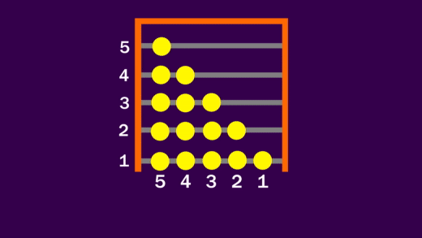

# The Top 5 Sorting Algorithms. No.4 will surprise you!

*"Students, line up in height order!"*
*\*chaos ensues among eight-year-olds\**

In the world of algorithms, sorting algorithms are those that are much more relatable and accessible to the general non-computer-scientist population. Humans are sorting things everyday — Prioritizing tasks that require less time, finding out who the richest person in your friend group is, looking around for the CPU with the highest clock speed or alphabetizing your bookshelf. Our naturally evolved brains have created neurons that help us find the largest or smallest out of... anything really and no one really knows how they intuit this information at a glance. But this method won't fly with computers

*Is that a one or a zero? What do you mean it's "To Kill a Mockingbird"??*

Computer scientists have worked out many step-by-step methods to sort values in ascending or descending order. Most of them are super useful but some, as you'll see, are beyond useless! This list isn't one that ranks an algorithm according to its speed or the space it needs or anything really. It's just in the order of preference I have to these algorithms (be it for novelty or practicality).

Here we go!

***

### 5. Bead Sort

This one is a real callback to my kindergarten days, I was forced to learn the abacus against my will and I hated it (a little cause I was forced, more cause I *did not* understand it).

Bead sort is a peculiar algorithm that uses **gravity** to sort values. The beads represent a single unit. So the integer 5 would be "•••••".  These beads are arranged vertically, that is, the taller a columns is the higher the value is. Now we turn the bead contraption on its side and let the beads fall (along the strings/poles). Eventually we end up with a similar position that we started with, a few columns of beads that represent values but in ascending order thanks to the properties of gravity!

*Source: https://www.youtube.com/watch?v=MneHbUXyKHg*

Implementing this algorithm in a computer would be a little difficult since there isn't the concept of gravity in computers but instead we create an *n×m* array of boolean values where each position represents the possible positions for a bead. Input the values given to us as a stack of booleans into the array. Then all we have to do is simulate gravity by moving every bead that can be moved to the left, to the left (or down if that matters to you, just initialize the array that way).

In terms of usefulness, if you're using an abacus, you may have the best known abacus sorting algorithm. But for a computer, the algorithm falls short in that regard. The manipulation of an amount of beads equal to the sum of the actual numbers given to be sorted would make the sorting of something like {1000,100} an unnecessarily strenuous task. But in terms of sheer wonder, it does the job!

### 4. Sleep Sort

Sleep is that fickle thing. We love to sleep but we never get around to it till it's too late.

Sleep sort is another peculiar one that leverages the physical property we know as time. Imagine we give 5 people, 5 numbers at the same time, and ask them to sleep for a number of seconds equal to that number and then immediately wake up and shout out the number to you, their majestic time-waster overlord. If you write down the numbers in the order that you hear them, then there you have it - a sorted array! *Surprised yet?*

The good thing about this algorithm is that it translates nicely into code. Instead of very obedient people, we use threads and the associated `sleep()` command. Just have them append their assigned value to an array shared among all of the threads. And now for no reason whatsoever, A cute, sleeping computer scientist puppy:

*Source: [Dog Sleeping on a Computer](https://www.lovethispic.com/image/211590/dog-sleeping-on-a-computer)*

Bad news for the anyone thinking was going to be at all useful (what can I say ¯\\_(ツ)_/¯ I'm a sucker for useless algorithms). If the maximum value in your array is 999 seconds then the algorithm takes about let's see... about 16 minutes to give you your sorted array. Yikes.

### 3. Pancake Sort

I must admit that this algorithm takes no.3 a little bit because of its name. Pancakes are such divine discs of sustenance. Any more divine and you'd get the dosa!

Pancake sort is best visualized as, unsurprisingly, a stack of pancakes that need to be sorted by radius, thickness or by a number written on them or whatever, the important part is to visualize the pancakes *mmmmm* OKAY enough visualization.  Now the key part is that the only allowed operation is that of flipping the top *n* pancakes. Step 1 is to identify the largest pancake. Now say the largest pancake is the 5th from the top. Now:

* Flip the top 5 pancakes.
* Flip all the pancakes.
* The largest pancake is now at the bottom. And so we ignore it for further operations.

Repeatedly do these operations on the largest pancake that isn't sorted and we'll finally end up with  a sorted stack of *delicious pancakes*.

*Source: [Wikipedia - Pancake Sorting](https://en.wikipedia.org/wiki/Pancake_sorting)*

To implement pancake sort is easy once you write a function that does the flipping. `flip(n)` flips the order of the top *n* pancakes. Iterate through the array to find the largest value and follow the steps given in the above *scrumptious* analogy.

The thing about Pancake Sort though is that for a normal computer with random access memory, the algorithm doesn't need to be this way. It's much more useful in systems that use tape memory that find the flip operation to be a common and easy-to-do operation.

### 2. Selection Sort

I like to call this one "Human Sort". It is, in fact, how most of us tend to sort difficult, long lists in our heads since our brain can't be relied on to sort things with those nice neurons of ours.

Very simple and easy to understand. Simply *select* the largest (or smallest) value from the list and keep it apart and continue to add to the values kept aside to eventually arrive at a sorted array.

*Source: [Wikipedia - Selection Sort](https://en.wikipedia.org/wiki/Selection_sort)*

The implementation is also rather human, one could say. Selection sort tends to produce very human-readable code in most programming languages. Just iterate through the array, pick the maximal value and append to another array, and repeat. Sometimes the array might be divided into a sorted and unsorted section to avoid allocating memory to another array.

This algorithm serves well for small sizes (obviously). But since there's a list iteration for each of the elements, it's not particularly performant.

### 1. Merge Sort

> "Divide and Conquer" - Julius Caesar (famous computer scientist and part-time roman emperor)

Merge sort is the first sorting algorithm I implemented and watched as code I wrote, sorted an array, thinking to myself "Wow this computer science thing is cool".

These sorting algorithm names tend to be very self explanatory, unlike law terms (what even is a notary). The whole strategy here is to keep cutting the array and its subarrays in half until you get a single element which is already sorted, a *trivial subproblem* as we say, it's obvious at that point. Now the trick is to combine subarrays into a sorted array to give a sorted array for the next combining.

*Source: [Wikipedia - Merge Sort](https://en.wikipedia.org/wiki/Merge_sort)*

Recursion. You know when you're streaming you screen to your friends and you accidentally stream your preview of your own stream. Creating a ~~black hole~~ infinitely continuing pattern.
That's basically recursion and we use it to implement merge sort by basically calling the same function for each subproblem. Just write a function to merge sorted arrays into sorted arrays by selecting the smallest from each in each iteration and appending to another array. Now you're all set!

This is by far the most efficient algorithm we've seen today for a general case. It reaches the maximum proven efficiency for what's called *comparison based sorting*, in fact. If you ever want to sort the results of the census of a country or a every Facebook profile, this is the one.

***

Sorting really is an iconic problem in computer science and many brilliant minds have been working on it for years and years. The results of which have been summed up nicely in a list for you by yours truly. Now go out and live your life and try not to think about pancakes whenever you're looking for the cheapest laptop on discount days.

***

