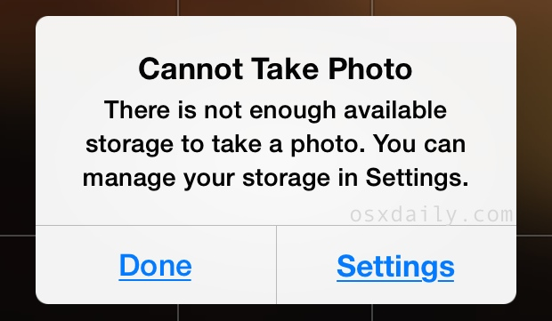
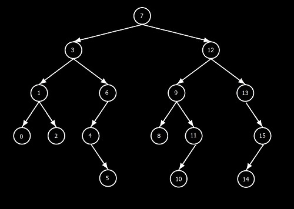
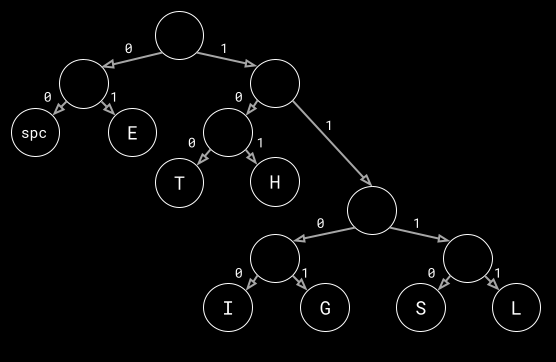

# ISPs don't want You to know this

*The Internet is always out when you really need it right?*

***

I'll give it to you straight up - The Internet Service Providers would charge you so much more if compression wasn't a thing. Call me a conspiracy theorist, but when I tell you how much bandwidth is being saved when things are compressed you'll believe me.

In short, compression is exactly what it sounds like. When you compress air, the same amount of air takes up less space. And when you compress information, the same amount of information takes up less space. And if you're someone who interacts with technology in any capacity, there's a high probability that you've seen this message at some point:

 

_Source: [osxdaily.com](https://osxdaily.com/2014/06/04/iphone-cannot-take-photo-not-enough-storage-workaround/)_

Compression, as you might imagine, mitigates this problem and enables you to store more with less. ISPs hate this since it means you get your cat videos in less bandwidth than you need when it's uncompressed. CAN YOU SEE THE LIGHT NOW!??!?! WAKE UP SHEEPLE. COMPRESS EVERYTHING AND STICK IT TO THOSE ISP TYRANTS!

_exhale_

Sorry about that... I simply hate ISPs with a passion.

So you must be thinking... "How does this work? I can get my head around compressing air but information?". Well it's simple once I tell you about the various, truly _magical_ if you ask me, techniques that computer scientists use to compress their 1s and 0s.

First some background about encoding in general.

## Encoding

The usual, boring way of encoding symbols in machine-understandable binary is by assigning integers to each symbol and then using the corresponding binary equivalent of the integers to encode that symbol.

For example:

```
Phrase: "SEE THE LIGHT"

Letters and their encoding:
S - 0 - 000
E - 1 - 001
T - 2 - 010
H - 3 - 011
L - 4 - 100
I - 5 - 101
G - 6 - 110
space - 7 - 111

Codified phrase:
000001001111010011001111100101110011010
```

A question you might have is this: "Isn't `000` the same as `0` and `001` the same as `1`?". Well, in mathematics, yeah it is. But not for our purposes of encoding. The problem we run into if we treat them the same is that we then won't be able to differentiate `010` being `SES` or just `T`. This ambiguity could lead to the decoding giving a different phrase. Hence the encodings have to be of the same length so we fill in the leading zeroes. This method is aptly named _fixed length encoding_.

I'll save you the trouble of counting... 39 bits were used to codify that phrase.  That's all good and all that but suppose we had a phrase like `the five boxing wizards jump quickly`. This has 27 different symbols and that means 5 bits per symbol, leading to a rather long code.

> Side note: That phrase is a pangram, a sentence that uses every letter of the alphabet and, in my opinion, is so much funnier than that one about the lazy dog.

And now with that out of the way, it is the perfect time to introduce Mr. Huffman and his super smart encoding technique.

## Huffman Coding

Not only is Huffman coding a smart way to code things, Mr. Huffman is a very smart man indeed. What David A Huffman realized was that the problem we came across (the one about `010` being `SES` or just `T`) was avoidable in ways other than making every encoding the same length. The key idea here is that we encode the more frequent symbols with lower length codes but encode less frequent symbols with higher length codes. Even if that means the length of the longest code may be higher than if we used boring fixed length encoding.

Let's try that example again with that idea in mind and see whether it makes a difference:

```
Phrase: "SEE THE LIGHT"

Letters, their *frequencies*, and an encoding:
E - 3 times - 0
T - 2 times - 1
space - 2 times - 10
... wait
```

Okay we ran into that problem again. is `10` decoded to `space` or `TE` ? This problem is well-known and encodings that fix the problem have a name, _prefix codes_. These encodings can always be unambiguously decoded since no code word will be a _prefix_ of another. What that means is if `0` is a code word then no other code word can be `0xxx...` since that will bring up the question of whether it's `0` and `xxx...` or the word `0xxx...`.

Also how do we know whether that encoding gives the best possible way to encode? Keep guessing? Heck no... We're computer scientists not gamblers.

Algorithms save the day again!

## The Problem

We need to find a set of codes that we can use to encode a certain phrase with the least number of bits and with zero ambiguity.

Before I explain the solution, you need to know about trees. And no, not he leafy kind... Ok well kinda leafy. No roots and all that anyw... Ok one root. Granted there are a lot of similarities, I'll tell you that this one doesn't photosynthesize though.



_Source: [differencebetween.net](http://www.differencebetween.net/technology/difference-between-binary-tree-and-binary-search-tree/)_

That's what a tree looks like in computer science. The key fact you need to know is starting from the highest node (the root node, we call it), there is only one single path to any of the other nodes. Go ahead, see for yourself. Go on, I know you don't believe me _**\*eyeroll***_.

Once you're convinced of that, you might see the route we're taking (extra marks if you notice the pun there). What we're going to do is assign a code word to each of the nodes that don't go anywhere, the bottom nodes some might say, or using the technical term, _leaf_ nodes. Why not any node you might ask... That's cause the one's that are on the path to another one ruin the solution, you'll see why soon.

## The Algorithm

We'll be designing the following function:

```
HuffmanCoding(P):
```

For a phrase `P` give the most optimal and unambiguous encoding.

```
Build a table of the symbols and their frequencies.
```

This step is rather easy in that what we do is we go through the phrase, if we see a symbol that we haven't seen yet then add it to the list with a frequency of 1 and if we have seen it then increment that symbol's frequency by 1.

```
Sort the table according to the frequencies, descending
```

After ordering the table by frequencies. It'll look like this for our example phrase `SEE THE LIGHT`

```
Symbol	Freq
S		1
L		1
I		1
G		1
T		2
H		2
spc		2
E		3
```

Next,

```
LOOP:
Take the symbols with lowest two frequencies and create a new node with the sum of the frequencies and the two symbols as children.
```

The `LOOP` is a label so that we can refer to it later.

What we do in this step is take the lowest two frequencies (These are always at the top of the table) and create a small little tree, technically a subtree, with those two as the children. Like so:

```
	   (SL)
	  /    \
	 S      L
```

Next,

```
Add the new node as a symbol to the table keeping the sorted order.
```

Now treat `(SL)` like a new symbol in our phrase basically, with a combined frequency of `2`. And add it to the table (respecting the sorted order mind you). So the new table looks like:

```
Symbol	Freq
I		1
G		1
SL		2
T		2
H		2
spc		2
E		3
```

Next,

```
Jump back to LOOP unless there's only one entry in the table.

Return the constructed tree
```

This is basically all we have to do. Keep doing those two steps until you can't take two from the list anymore.

Eventually, by building trees with other smaller trees, with the last entry in the table representing the root node, we get a nice, big tree that looks something like this:



I've taken the liberty of marking the edges between the trees with 1s and 0s because this is how we'll be extracting the encoding for each symbol. To get the code for a symbol, we just follow the singular path to that symbol. 

Also, do you now see why the codes are only on leaf nodes? See, if there were symbols in nodes that are the children of other symbol nodes, then the code for the parent node would in fact be a prefix of the child symbol's code, and we run into our old problem again!

## The Result

Now we have a prefix free, variable length Huffman encoding for each symbol:

```
Symbol	Code
S		1110
L		1111
I		1100
G		1101
T		100
H		101
spc		00
E		01
```

Using this we can encode the phrase again:

```
Phrase: SEE THE LIGHT
Code: 	11100101001001010100111111001101101100
```

I'll save you the trouble again - That's _only_ 38 bits used to encode the message, compared to our earlier 39 bits. Admittedly, not that huge of a saving. BUT we still managed to use less bits to codify the exact same text. I'd say this is a win and a proof of concept. This may not impress you but the savings improve as the message gets longer:

```
Phrase: SEE THE LIGHT SEE SEE
```

The codes are getting a rather large so I'll just give you the numbers - The fixed length encoding for this phrase is 63 bits long as compared to the 58 bit long Huffman encoding. HUZZAH! ALL HAIL COMPRESSION!

***

Compression techniques are actually all around us as we interact with data. Mostly images and videos since they're so large that they really need compression. I highly suggest to anyone who's interested, [this video](https://www.youtube.com/watch?v=OtDxDvCpPL4) for another (maybe nicer) explanation of Huffman encoding and also some more compression techniques and how they effect us. 

And let's not forget our original message: ISPs ARE EVIL.
