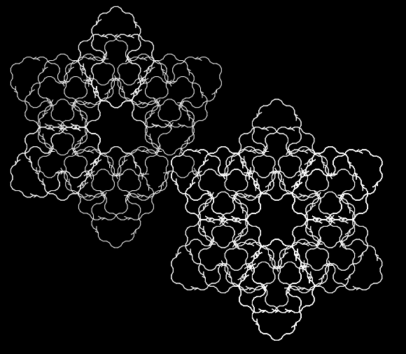
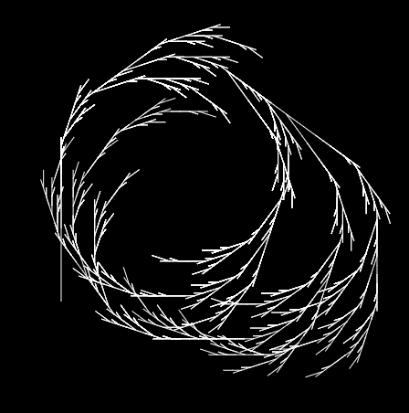
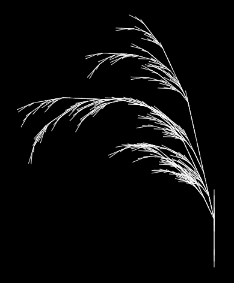

# Automata Theory - Programming Assignment Part 1 Report

## Question 1

All of the code for the *Question 1* problems depends on  `lindenmayer.browser.js`.

### 1.1 "I’m a mirrorball"

`q1/src/p1-1.html` contains the code used to generate this problem.

Using `9` iterations, The output image for this problem is generated at `q1/images/i1.png`.

### 1.2 “Is that a tree?”

`q1/src/p1-2.html` contains the code used to generate this problem.

Using `4` iterations, The output image for this problem is generated at `q1/images/i2.png`.

### 1.3 “Is that a tree?”

`q1/src/p1-3.html` contains the code used to generate this problem.

Using `4` iterations, The output images for this problem are generated at 

`q1/images/i31.png-i35.png`.

### 1.3 “Content without context is noise”

`q1/src/p1-4.html` contains the code used to generate this problem.

Using `9` iterations, The output images for this problem are generated at `q1/images/i4.png`.

## Question 2

### 2.1 Figure 1: Stick Plant

The JSON for the L-system is given in `q2/1.json`.

**Ideas and Approaches**: First thought on seeing fig 1.a was that the first iteration will look something like a long central line with a branch right and a branch left further on. On trying to render this, I noticed that the top most end was a little short and so I added another alphabet that just extends it a little more and managed to generate a render that closely resembles the figure.

### 2.2 Figure 2: Santa K(l)osh

The JSON for the L-system is given in `q2/2.json`.

**Ideas and Approaches**: fig 2.a didn't lend me much help but fig 2.b was rather helpful in that you could see the overall structure a little better since the details were less clear.  On my first attempt, I generated a kind of zigzag pattern that only zigzags up and with the middle zag bigger. This, on some more iteration, ended up with a rather accurate render.

