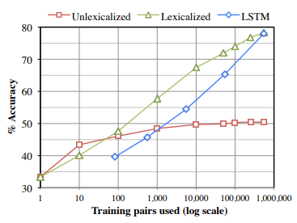
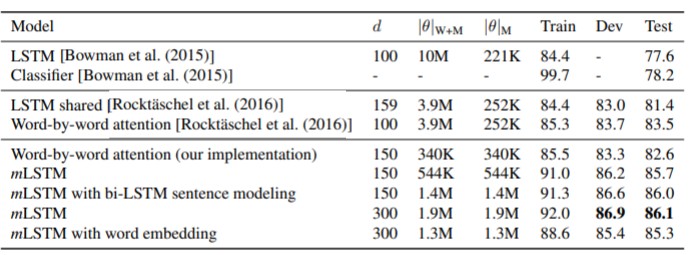

# Intro to NLP - Interim Report

**Team**: 32 - NAGin

**Team Members**: Amal Sunny, George Paul, Nukit Tailor 

## Description of work done

Work done so far consists mainly of a review or relevant literature:

#### A large annotated corpus for learning natural language inference

*Bowman et al. [arXiv:1508.05326](https://arxiv.org/abs/1508.05326)*

The Stanford Natural Language inference dataset was introduced with this publication. The paper describes how the data was acquired and its possible applications. 

##### Data Collection

Amazon Mechanical Turk workers were used to annotate premise-hypothesis sentence pairs with either Entailment(E), Contradiction(C) and Neutral(N). 98% of cases emerged with a three-annotator consensus and 58% emerged with a five-annotator consensus. The SNLI dataset is up to two orders of magnitude larger than any previous datasets such as RTE challenge tasks and SICK datasets. The corpus comes to around 570,000 sentence pairs.

##### The data as a platform for evaluation 

The paper talks about the following models, evaluated on the SNLI dataset along with the RTE-3 and SICK datasets for comparison:

* **Excitement Open Platform Models**: An edit distance based classifier algorithm which is a popular platform for NLI research.
* **Lexicalized Classifier**: A simple lexicalized classifier; 3 unlexicalized and 3 lexicalized feature types were implemented and tested.
* **Sentence Embeddings**: The next model uses a neural network. Before input is given to the neural network, sentence embedding is done as an intermediary task and vector representations are produced that are given to the (LSTM) RNN neural network classifier.

##### Analysis

A learning curve for the unlexicalized, lexicalized and LSTM neural network models  are shown and it is obvious that these models all benefit from the large size of the SNLI dataset.

##### Transfer learning with SICK

Since the LSTM neural network learned so successfully, it was evaluated on the SICK entailment task using simple transfer learning. The same was tried with the RTE-3 challenges did not yield similarly successful results. This suggests that the size of the dataset is imperative to the success of this method. 

#### Natural language inference for Malayalam language using language agnostic sentence representation

*Renjit, Sara, and Sumam Idicula. [PeerJ. Computer science vol. 7 e508. 4 May. 2021, doi:10.7717/peerj-cs.508](https://www.ncbi.nlm.nih.gov/labs/pmc/articles/PMC8114806/)*

The paper explores NLI for a low resource language (Malayalam), and details the different approaches taken towards creating the NLI model for it. As the author had taken a low resource language, they had to generate a dataset for the task - but we digress as that isn’t related to our task at hand. 

Both problems of binary (entails or contradicts/neutral) and multi-class classification are considered for all models. The models each have a different sentence representation to view their effect on the model’s performance. Used sentence representations are:

* Doc2Vec (paragraph vector)

* fastText word

* vectorBERT (Bidirectional Encoder Representations from Transformers)

* LASER (Language Agnostic Sentence Representations)

After applying their models to their dataset, they arrived at the conclusion that LASER gave the best performance (to a noticeable extent).

#### Learning Natural Language Inference with LSTM

*Shuohang Wang, Jing Jiang. [arXiv:1512.08849](https://arxiv.org/abs/1512.08849)*

In this paper, the authors used a match Long short term memory(LSTM) to perform word-by-word matching of the hypothesis with the premise instead of deriving sentence embeddings for the premise and the hypothesis to be used for classification. This LSTM is able to place more emphasis on important word-level matching results. In particular, we observe that this LSTM remembers important mismatches that are critical for predicting the contradiction or the neutral relationship label. 

##### LSTM

LSTM is a special form of recurrent neural networks (RNNs), which process sequence data. LSTM uses a few gate vectors at each position to control the passing of information along the sequence and thus improves the modeling of long-range dependencies.

**Data used**: SNLI corpus , without the sentence pairs marked with ‘-’ which meant ‘lack of consensus from human annotators.’ 

##### Results

$d$ is the dimension of the hidden states. $|θ|_{W+M}$ is the total number of parameters and $|θ|_M$ is the number of parameters excluding the word embeddings.
The paper also did further analysis using values given by gate vectors of mLSTM. The paper concluded by saying that there is more confusion between neutral and entailment and between neutral and contradiction than between entailment and contradiction. This shows that neutral is relatively hard to capture. They also hypothesized that mLSTM models would outperform the state-of-the-art performance reported back then.However , this model did not give good results when tested on a smaller textual entailment corpus, SICK corpus. They believed that this is because our model learns everything from scratch except using the pre-trained word embeddings.

## Timeline

**Till 21 March 2022**: Continue literature review and gaining comprehension of the task and solution

**Starting 21 March 2022**: Begin work on the foundations of the model

**2nd week of April 2022**: Complete a basic model and begin fine-tuning

## Work Plan

The continuing work plan will be to combine the gained knowledge from the literature review and along with some more reading, try to implement a model that accomplishes basic Textual Entailment Recognition tasks. 

Some other resources we plan to refer to in the future are:

* https://www.cs.upc.edu/~ageno/anlp/textualEntailment.pdf
* https://www.proquest.com/openview/1f496dd128e01b6c0b2a030d2a2447f8/1?pq-origsite=gscholar&cbl=18750
* https://affine.ai/natural-language-inferencing-nli-task-demonstration-using-kaggle-dataset/