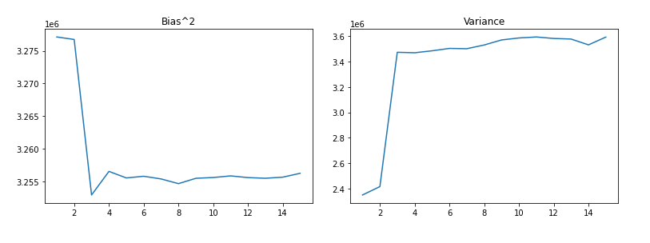
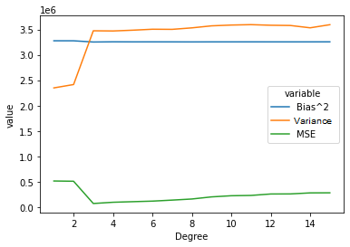

# Report - Assignment 1, Machine Data and Learning (CS7.301)

## Task 1

Linear Regression is a machine learning algorithm that, in essence, finds a line/curve that best fits a certain training dataset. The function we get is then used to predict values that haven't occurred in the dataset - say, points in the dataset are of the form `f(xi) = yi`, then we can use the best fit function that was found during the linear regression to predict `f(x) = y` for any `x`.

The `LinearRegression().fit()` method is a part of the *scikit-learn* Python library. The method signature is 

```python
fit(<Training Data>, <Target Values>)
```

The `LinearRegression` method is given an ordered array of training data i.e. the `xi`s and the targets i.e. the `yi`s. 
For simple linear regression with one feature, the line we need is:
$$
y = w_1x + b
$$
The $w_1$ and $b$ are the values that are needed to describe the line. The method changes these values in certain ways to find the best fitting line. Firstly, random values for $w_1$ and $b$ are chosen and then:

1. The Mean Square Error is calculated over each of the data points versus the line currently being considered using the following formula:
$$
\text{MSE} = \frac{1}{n}\sum_{i=1}^n(y-y_i)^2
$$

2. The goal is to minimize this Mean Square Error. To do this, we change the weights $w_1$ and $b$ to some new weights $W_n$ according to:
$$
W_n = W_o + \Delta w
$$
3. Here, $\Delta w$ is the Gradient Descent. The Gradient Descent is a number used to adjust a value to eventually obtain the local minimum of the function. Using it, the new weights are calculated.

4. After the new weights are calculated, the MSE of the newly created line is measured.

5. If the MSE begins to increase with a new iteration of the line, then the algorithm can stop and return the line with the minimum MSE.


## Task 2

The function classes of the models used are polynomials of higher and higher degree. These higher degrees provide more ways in which the function can curve to fit the data best. But in some situations, the data is best fit by a function with less maxima/minima. So, in that vein, our objective is to find the model that uses a class of functions that minimize both bias and variance by fitting the data best. 

The plot of $\text{Bias}^2$ seems to decrease as polynomial degree increases. The decrease in bias seems to be a result of the freedom higher degrees give the function. The plot of $\text{Variance}$ seems to increase as the polynomial degree increases. This looks like a side effect of the higher degrees meaning that the function fits around the gaps in the data.



Having plotted the $\text{Bias}^2$ and $\text{Variance}$, we can observe that for each degree of function classes, the values vary. But it seems there is a relation between the two, in that - As $\text{Bias}^2$ increases, $\text{Variance}$ decreases and when $\text{Bias}^2$ decreases, $\text{Variance}$ increases. It seems, that $\text{Bias}^2$ and $\text{Variance}$ are inversely related. 

## Task 3

| Degree | Bias         | Variance     | MSE           | Irreducible Error |
| ------ | ------------ | ------------ | ------------- | ----------------- |
| 1      | 3.277119e+06 | 2.348615e+06 | 514097.124410 | -5.111637e+06     |
| 2      | 3.276735e+06 | 2.414815e+06 | 509097.035409 | -5.182452e+06     |
| 3      | 3.252960e+06 | 3.474084e+06 | 70731.777622  | -6.656312e+06     |
| 4      | 3.256567e+06 | 3.470359e+06 | 94947.234827  | -6.631979e+06     |
| 5      | 3.255565e+06 | 3.485755e+06 | 106462.621166 | -6.634857e+06     |
| 6      | 3.255822e+06 | 3.504672e+06 | 117443.670912 | -6.643050e+06     |
| 7      | 3.255412e+06 | 3.502291e+06 | 137638.082151 | -6.620065e+06     |
| 8      | 3.254692e+06 | 3.531652e+06 | 159442.000623 | -6.626903e+06     |
| 9      | 3.255509e+06 | 3.571388e+06 | 201075.268821 | -6.625822e+06     |
| 10     | 3.255630e+06 | 3.587098e+06 | 223598.437256 | -6.619129e+06     |
| 11     | 3.255878e+06 | 3.594914e+06 | 229723.100738 | -6.621069e+06     |
| 12     | 3.255618e+06 | 3.583122e+06 | 258027.975122 | -6.580712e+06     |
| 13     | 3.255515e+06 | 3.578420e+06 | 259463.756701 | -6.574472e+06     |
| 14     | 3.255684e+06 | 3.532711e+06 | 279654.884721 | -6.508741e+06     |
| 15     | 3.256274e+06 | 3.593987e+06 | 281192.371228 | -6.569069e+06     |

The Irreducible Error is a value that is intrinsically a part of the data and cannot be modelled by any model in particular. Therefore Irreducible error doesn't change across any parameter except the data. 

In our case, There seems to be some sort of error which leads to there being a change in the values.

## Task 4

The $\text{Bias}^2 - \text{Variance}$ graph is an interesting one. The inverse relations between $\text{Bias}^2$ and $\text{Variance}$ mean that there is an optimal model complexity - a particular degree for the function class that means we can minimize both bias and variance. This value is the $x$ value for which the plots of $\text{Bias}^2$ and $\text{Variance}$ intersect. 



The primary objective of plotting these two measures on the same graph is to avoid the chance of overfitting and underfitting the model for our dataset and needs. 

At any level of complexity greater than the level at which the plots intersect is an overfitting of the model. The model will tend to bend around the gaps in the data and lead to a higher variance than is desired even though the bias will decrease.

At any level of complexity less than the level at which the plots intersect is an underfitting of the model. The model will not have enough freedom in the sense that -  there aren't enough features to model in the polynomial such that the data is fit at a satisfactory level. 

