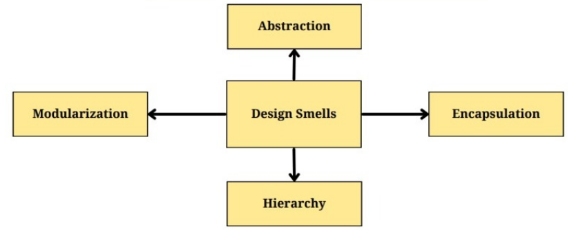

# Software Engineering - Project 1 Report


## Task 1

Due to compression and page size limits, we've elected to upload the UML images to Google Drive. Please find the images at this link:

https://drive.google.com/drive/folders/1S8JGwaUAUz0U1tD2uZfs8oEv5Xme3xjs?usp=share_link


#### User management 

It is observed that no other class is using constructor of the user, user object can create another user.

User is observed when he is liking or disliking a track.

Tracks could be added by user but no specific directories could be added by user.


#### Library management

Assumed that the Directory class is already available the library management interacts with Albums Artists and tracks. Track mapper tracks artists to tracks and Album mapper with albums respectively. The playing mechanism is directly interacts with track.


#### Last.FM integration

When an user plays, or likes (in this case loves) a track last.fm service is invoked to mark information of that user to that track and album to make references.


#### Administration

Creation of directories, creation of fusers and adding the uploaded files to the directories are being handled in the Administration system.

## Task 2a

Design smells are indicators of poor design choices or potential problems in a software system's design. They are called "smells" because they are not bugs or errors, but rather they are indications that something might not be quite right in the design.

There are many different types of design smells that can appear in software systems. The design smells has classified into 4 main types:




#### Design Smell Explanations


#### Identified Design Smells

1. `Constants` showed unnecessary abstraction. The members in this class were pertinent to other classes and used in only a few places.

2. `UserResource` has become a god class. With many methods and responsibilities, it shows a lack of abstraction.

3. The same issue shows in `PlaylistResource`. It garners too many responsibilities and shows a lack of abstraction.

4. `MimeType` is an unnecessary abstraction. The members are used in only a few places and mainly within the `MimeTypeUtil` class.

5. `UserUtil` does not have any references in any other part of the project. An easy example of a dead class.

6. Methods in `LastFmUtil` were used only in `LastFmService`. An unnecessary abstraction.

7. A cyclically-dependent modularization exists through the following classes:

   ```
   CollectionService; CollectionVisitor; AppContext; CollectionWatchService; ImportAudioService; LastFmService; PlayerService
   ```

## Task 2b and 3b

To Identify the Code Metrics the tools used were:

- MetricsReloaded
- Sonarqube
- Designite

#### Lines of code

It’s a software metric used to measure the size of a program by counting the number of product lines of the program’s source code.

A high lines of code hints at long methods and unnecessary complexity and higher class count.

```
Results:
Before	|	After
14615	|	14721
```

After refactoring, the number of production lines has increased as a result of more added classes than removed ones.


#### Average Cyclomatic Complexity

Cyclomatic Complexity is a measurement used to determine the stability and level of confidence in a program. It measures the number of linearly-independent paths through a program module.

This metric is calculated per method and averaged out. It hints at a high number of branches i.e. `if`, `switch` statements etc.

```
Results:
Before	|	After
1.81	|	1.8
```

After refactoring, Average Cyclomatic Complexity decreased slightly. This wasn't expected as no code branching was dealt with.


#### Average Cognitive Complexity

It’s a measure of how difficult a unit code is to intuitively understand. It determines how difficult your code will be to test, Cognitive complexity tells you how difficult your code will be to test, read and understand. 

This metric is calculated per unit and averaged out. A high Cognitive Complexity score hints at long methods, unnecessary abstraction and long-winded hierarchies. 

```
Results:
Before	|	After
1.08	|	1.01
```

After refactoring, cognitive complexity showed a marked decrease. Presumably the main contribution to this would be the splitting up of the `UserResource` and `PlaylistResource` classes.


#### Lack of cohesion of methods

It’s a measure for the number of not connected pairs in a class representing independent parts having no cohesion.

A high lack of cohesion points to god classes and a lack of abstraction.

```
Results:
Before	|	After
3.00	|	2.83
```

After refactoring, Lack of cohesion goes down. The splitting up of the `UserResource` and `PlaylistResource` classes into divisions that make more sense together most likely contributed to this score.


#### Response for class 

RFC metric is the total number of methods that can be potentially be executed in response to a message received by an object of a class.

Responses for class being high is an indication of higher class-wise complexity with more possible outputs per call.

```
Results:
Before	|	After
5.60	|	16.59
```

After refactoring, there was a significant increase in the response for class reported by the metric measurement. All this despite our efforts in decreasing the complexity of classes. Our team believes there's been some error in the calculation of this as there are changes reported even in parts of the code that were not touched.


#### Weighted Method complexity 

WMC is the sum of complexities of methods which are defined in a class, which represents the complexity of a class as whole, and it is used to indicate the development and maintenance effort for the class.

This metric is weighted according to the cyclomatic complexity.

A high score indicates, similar to cyclomatic complexity, at a high number of branches i.e. `if`, `switch` statements etc.

```
Results:
Before	|	After
9.13	|	9.06
```

Again similar to cyclomatic complexity, we're unsure why exactly WMC has decreased.


## Task 3a

#### Removed `Constants` class

This class exhibited no real behaviour and only abstracted some data members that were used in only some places.


**Before:**

```java
public class Constants {
    public static final String DEFAULT_LOCALE_ID = "en";

    public static final String DEFAULT_TIMEZONE_ID = "Europe/London";
    
    public static final String DEFAULT_ADMIN_PASSWORD = "$2a$05$6Ny3TjrW3aVAL1or2SlcR.fhuDgPKp5jp.P9fBXwVNePgeLqb4i3C";
    
    public static final String DEFAULT_USER_ROLE = "user";
    
    public static final Set<String> SUPPORTED_AUDIO_EXTENSIONS = ImmutableSet.of(
            "ogg", "mp3", "flac", "mp4", "m4a", "m4p", "wma", "wav", "ra", "rm", "m4b");
}
```


**After:**

```java
// deleted Constants
// relocated its members to the relevant places:
```

```java
public class FilenameUtil {
    // ...
	public static final Set<String> SUPPORTED_AUDIO_EXTENSIONS = ImmutableSet.of("ogg", "mp3", "flac", "mp4", "m4a", "m4p", "wma", "wav", "ra", "rm", "m4b");
    // ...
}
```

```java
public class LocaleUtil {
	// ...
    public static final String DEFAULT_LOCALE_ID = "en";
    // ...
}
```

```java
public class TokenBasedSecurityFilter implements Filter {
	// ...
    private void injectAnonymousUser(HttpServletRequest request) {
        final String DEFAULT_TIMEZONE_ID = "Europe/London";
        // ...
    }
}
```

```java
public class UserResource extends BaseResource {
	// ...
    @GET
    public Response info() {
        final String DEFAULT_ADMIN_PASSWORD = "$2a$05$6Ny3TjrW3aVAL1or2SlcR.fhuDgPKp5jp.P9fBXwVNePgeLqb4i3C";
        // ...
    }
    // ...
}
```

```java
public class UserUpdateResource extends BaseResource {
	// ...
	@PUT
    public Response register(
        @FormParam("username") String username,
        @FormParam("password") String password,
        @FormParam("locale") String localeId,
        @FormParam("email") String email) {
        
       	// ...
       	final String DEFAULT_USER_ROLE = "user";
       	// ...
        
    }
}
```


#### Removed `UserUtil` class

The `UserUtil` class was never being utilised anywhere. We've removed the code associated with it.


**Before:**

```java
public class UserUtil {
    // ...
}
```


**After:**

```java
// deleted UserUtil
```


#### Removed `MimeType` class

The `MimeType` class was only abstracting away some constant data members. These were relocated to the more fitting, populated class `MimeTypeUtil`.


**Before:**

```java
public class MimeType {
    public static final String IMAGE_X_ICON = "image/x-icon";
    
    public static final String IMAGE_PNG = "image/png";
    
    public static final String IMAGE_JPEG = "image/jpeg";
    
    public static final String IMAGE_GIF = "image/gif";
    
    public static final String APPLICATION_ZIP = "application/zip";
}
```


**After:**

```java
// deleted MimeType
```

```java
public class MimeTypeUtil {
    public static final String IMAGE_X_ICON = "image/x-icon";
    
    public static final String IMAGE_PNG = "image/png";
    
    public static final String IMAGE_JPEG = "image/jpeg";
    
    public static final String IMAGE_GIF = "image/gif";
    
    public static final String APPLICATION_ZIP = "application/zip";
    // ...
}
```


#### Removed `LastFmUtil` class

All the members of `LastFmUtil` were only being utilised by the `LastFmService` class, an unnecessary abstraction. These methods were moved to `LastFmService`.


**Before:**

```java
public class LastFmUtil {
    public static PaginatedResult<Track> getLovedTracks(String user, int page, int limit, String apiKey) {
        //...
    }
    public static PaginatedResult<Track> getAllTracks(String user, int page, int limit, String apiKey) {
        //...
    }
}
```


**After:**

```java
// deleted LastFmUtil
```

```java
public class LastFmService extends AbstractScheduledService {
    // ...
    
    public static PaginatedResult<Track> getLovedTracks(String user, int page, int limit, String apiKey) {
        //...
    }
    public static PaginatedResult<Track> getAllTracks(String user, int page, int limit, String apiKey) {
        //...
    }
    
    // ...
}
```


#### Redistributed `UserResource` class

The `UserResource` class contained many responsibilities. The god class' methods were redistributed among two other classes - `UserLastFmResource` and `UserUpdateResource`.


**Before:**

```java
public class UserResource extends BaseResource {
	// god class
}
```


**After:**

```java
public class UserResource extends BaseResource {
    // ...
	checkUsername() { //...
    }
    info() { //...
    }
    view() { //...
    }
    list() { //...
    }
}
```

```java
public class UserLastFmResource extends BaseResource {
    // ...
	registerLastFm() { //...
    }
    lastFmInfo() { //...
    }
    unregisterLastFm() { //...
    }
}
```

```java
public class UserUpdateResource extends BaseResource {
    // ...
	register() { //...
    }
    update() { //...
    }
    login() { //...
    }
    logout() { //...
    }
    delete() { //...
    }
}
```

#### Redistributed `PlaylistResource` class

The `UserResource` class held many responsibilities. The god class' methods were refactored among one other class - `PlaylistModificationResource`


**Before:**

```java
public class PlaylistResource extends BaseResource {
	// god class
}
```


**After:**

```java
public class PlaylistResource extends BaseResource {
	createPlaylist() { //...
    }
    loadPlaylist() { //...
    }
    party() { //...
    }
    deletePlaylist() { //...
    }
    listPlaylist() { //...
    }
    listTrack() { //...
    }
    clear() { //...
    }
    buildPlaylistJson() { //...
    }
}
```

```java
public class PlaylistModificationResource extends BaseResource {
	updatePlaylist() { //...
    }
    insertTrack() { //...
    }
    insertTracks() { //...
    }
    moveTrack() { //...
    }
    delete() { //...
    }
    buildPlaylistJson() { //...
    }
}
```


## Contribution

#### Team Members:

- George Paul - 2021121006
- Manaswini Tharigopula - 2020113015
- Brahma - 2022900007
- Srikanth - 2021900008
- Tisha Dubey - 2020101101

**Task 1**: Brahma and Srikanth

**Task 2**: Tisha and Manaswini

**Task 3**: George