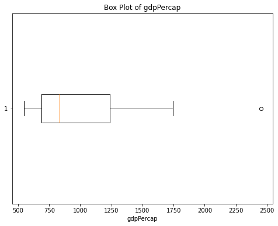
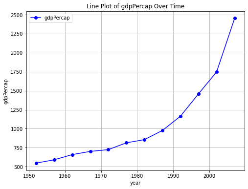
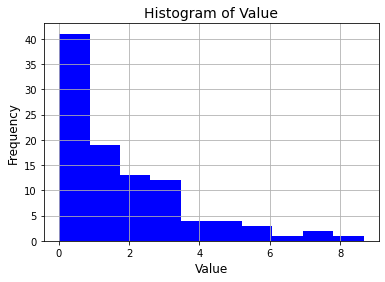
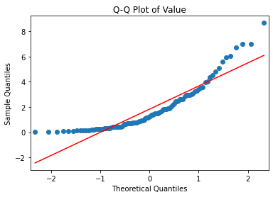
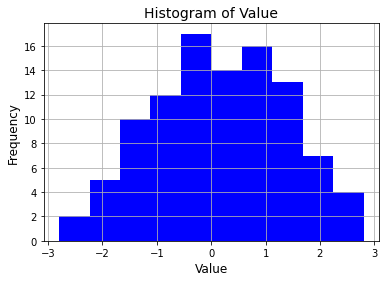
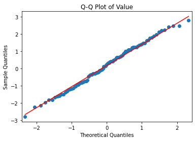

# BRED Assignment 3

<b>- George Paul (2021121006)</b>

## Question 1

###### Figure 1

The graph, presumably, wants to show that iPhone sales have been going well. This is, in fact, not the case. The graph displays *cumulative* iPhone sales. The nature of cumulative measures being that they are always increasing in this case, since there's no such thing as a negative sale. The graph actually shows a small decrease in the rate of sales as well near the latest points of data. All this points to the fact that sales are not exactly as good as Mr. Cook wants to convey.

A better way to visualise this data would be to consider visualising the sales in certain durations of time, say annually. The data would better reflect whether the sales this year have been better than the last or other previous years and hence showing whether sales have improved or not.

###### Figure 2

The news channel, presumably, wants to convey that the number of Americans that have tried marijuana has been increasing over the years. The chosen visualisation is a pie chart. These are normally used to represent data that is a part of a whole. In this case, there is no whole. The data simply conveys an absolute magnitude. 

To represent an increase in its magnitude over time, a better way to visualise would be with a line graph that shows the change in a variable (the number of Americans that have tried marijuana) over time.

## Question 2

Code and some answers can be found in bundled python notebooks in `./q2` prefixed with `q2_`. The method has been repeated for the following data points:

- Chlorides
- Sulphates
- Total Sulphur Dioxides

> What do these variations suggest about the influence of outliers on different descriptive statistics as well as aspects of the data? Elaborate on the importance of outlier detection in your analysis.

The stats don't fundamentally change after the removal of outliers. By nature, outliers mustn't appear too many times in a dataset (else they no longer are outliers) so their absence makes but a small nudge on the statistics. The standard deviation, though, becomes lower since the range of data has decreased having removed those outside the outlier boundary.

Outlier definitions certainly need work as it can change depending on the nature and source of the data. But by definition, outliers mustn't be made to have an effect on the study. Outlier detection and removal remains important for this sort of analysis, the presence of outlier, regardless, doesn't have much effect on whatever inferences that could be derived from the data. Removing them makes us surer of the results since measures such as standard deviation will decrease.

## Question 3

Code and visualisations can be found in `./q3/q3.ipynb`

###### Inappropriate Visualisation

The box plot, an otherwise useful visualisation, shows the chosen data in a rather useless way. The plot shows us information on how the data is distributed probabilistically. Looking at this visualisation one could easily answer a question like "What is the most common annual GDP per capita for India?". The fact that the answer to this question is rather useless easily explains why this plot is not appropriate for this data.

###### Appropriate Visualisation

The line graph is chosen as an appropriate visualisation for this data. The question that this graph answers is one such as "How has the per capita GDP of India evolved over the years?". A useful answer and thus a useful visualisation.

## Question 4

Code and visualisations can be found in `./q4/q4.ipynb`

###### Fig.1.1

###### Fig.1.2

The given data was assessed using a histogram and a Q-Q plot given by Fig.1.1 and Fig.1.2. The histogram shows an exponential, lower-end leaning and the Q-Q plot tested against a Gaussian distribution confirms that the given data isn't distributed normally. Instead the distributions shows signs of being a Logarithmic distribution.

#### After Transformation

###### Fig.2.1

###### Fig.2.2

To transform the data to make it more representative, the primary choice with a Logarithmic distribution as input, we perform a power transform. The transform chosen in this method in particular is the Box-Cox Transform.  Described briefly as follows:
$$
{ x }_{ \lambda  }^{ ' }  =  \frac { { x }^{ \lambda  } - 1 }{ \lambda  }
$$
This transformation makes the data a little more representative by making it more Gaussian. Fig.2.1 and Fig.2.2 shows the histogram and Q-Q plot after the transformation.