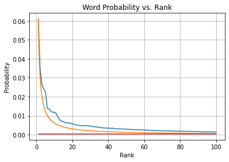

# IRE Assignment 3 - Report 

## 2.2 Zipf's Law

For this part of the assignment, the task was to verify the applicability of Zipf's law with the French language. The corpus under examination was _20000 Lieues Sous Les Mers_. The task was done within one Python Notebook named `zipf.ipynb`.  The corpus was tokenised and only tokens containing alphabets alone were considered.

Word frequencies were counted and ranked. Using this the probabilities of the words occurring were calculated.

The main experimental result is the following graph:

 

The graph plots Word Probability vs Rank and features three plots:

- The yellow curve shows the expected relation as described by Zipf's Law.
- The blue curve shows the relation derived from examining the corpus and plotting those probabilities and ranks.
- The red curve shows the resultant curve obtained by training a Linear Regression model on the data described by the blue curve.

As you can see, the examination of the corpus shows that the French language (or at least this sample of it) exhibits the property described by Zipf.

 

> Justify whether linear regression models can be used to explore the dependence between words' probabilities and their ranks. Comment on how the approximation fits the theoretical formula.

The linear regression model doesn't quite match with neither the theoretical curve, nor the experimentally obtained data. The problem being that the linear regression  model ends up giving a straight line that can never be fit to both the initially large probabilities and the smaller probabilities. The dependence between the probabilities and the ranks can be explored well only after the initial spike in probability given by the first few ranked words is ignored.

> From the data you obtained, find 10 examples of extremely frequent, very rare, and averagely frequent words to fill out the following table

| Very Frequent Words | Averagely Frequent Words | Very Rare Words |
| ------------------- | ------------------------ | --------------- |
| et                  | parlai                   | etrangere       |
| de                  | sang                     | voulait         |
| le                  | pleine                   | vient           |
| les                 | morts                    | repondis        |
| le                  | troupeaux                | riches          |
| il                  | gloire                   | quitte          |
| dans                | entendu                  | prive           |
| que                 | cheveux                  | prenant         |
| je                  | quel                     | partir          |
| des                 | prote                    | necessite       |

> Intuitively, which of the above three word categories could be more useful in information retrieval? Which of these categories is likely to have large tf-idf values? Why?

With TF-IDF, the main contributor to its magnitude remains the term frequency. The inverse document frequency, being a logarithmic value, ends up only multiplying the TF-IDF value and not really changing the orders of magnitude. For these three cases in particular, the TFs vary by orders of magnitude ($\pm100$) but the IDFs only multiply by $\sim2$. Hence the most frequent words remain the ones with the most TF-IDF.