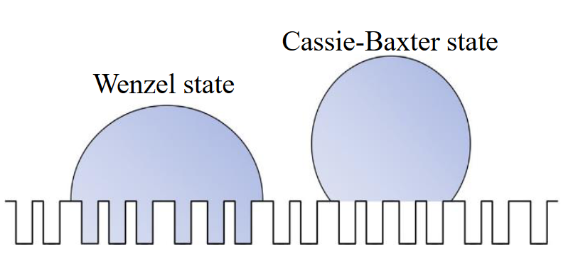

# Topics in Nanoscience - Assignment 1

### A. 1

- **Zinc Oxide Nanoparticles**: Used in sunscreen, the offer more UV protection than other materials. Zinc Oxide Nanoparticles scatter and absorb UV radiation due to their smaller size, matching the wavelengths.
- **Iron Oxide Nanoparticles**: These nanoparticles exhibit super-paramagnetism. This makes it a perfect candidate to be a contrast agent for use in MRI machines.

### A. 2

A Silicon atom is 200pm in diameter.
$$
200\text{pm} = \frac{200}{1000} \text{nm} \\
=0.2\text{nm} \\
$$
The number of silicon atoms that fit in fabricated lines of size 6nm is:
$$
\frac{6\text{nm}}{0.2\text{nm}} = 30 \text{ atoms}
$$

### A. 3

Nanoparticles that show Localised Surface Plasmon Resonance (LSPR) are known as Plasmonic nanoparticles.

Some examples are Gold and Silver metal nanoparticles.

### A. 4

<!---->

### A. 5

Quantum Dots are better suited as fluorescent probes when compared to Alexa Fluor 488 due to the following reasons:

- A higher degree of photostability.
- A narrower emission spectrum.
- Higher brightness.

### A. 6

For nanomaterials and nanoparticles, their **size** and **surface area** are two broad features that change and some unique properties.

### A. 7

Size effects tend to appear when dimensions start being in the nanoscale range of less than 10nm.

### A. 8

The number of atoms in the $n$th shell of a close-packed full-shell cluster is:
$$
10n^2 +2
$$
And the total number of atoms in a cluster of $n$ shells is:
$$
1+ \sum10n^2 +2
$$
We need to find $n$ such that:
$$
s(n) = \frac{10n^2 +2}{1+ \sum10n^2 +2} \approx 50\%
$$
Calculating for $n=1,2,3,4,5$
$$
s(1) = 92\% \\
s(2) = 76\% \\
s(3) = 63\% \\
s(4) = 52\% \\
s(5) = 45\% \\
$$
We can see that at $n=4$ we get a ratio closest to $50\%$.

The required answer is the total number of atoms. Total number of atoms for $4$ shells of a close-packed full-shell cluster is:
$$
1+ \sum^4_{n=1}10n^2 +2 = 309
$$

### A. 9

Intensive properties are the properties of types of materials that *do not* depend on their size.

Nanomaterials tend to have some properties that change according to their size even though  these would be intensive properties in larger scales. Some examples are melting point, ability to scatter light and catalysing capacity.

### A. 10

Volume of the sphere:
$$
V_S = \frac{4}{3}\pi(5\text{nm})^3 = 523.6\text{nm}^3
$$
Volume of one atom in the sphere:
$$
\frac{V_S}{N} \\
\frac{523.6\text{nm}^3}{8000} = 0.065\text{nm}^3
$$
Radius of one atom:
$$
\frac{4}{3}\pi(r_A)^3 = V_A = 0.065\text{nm}^3 \\
\therefore r_A =\sqrt[3]{0.065\text{nm}^3 * \frac{3}{4\pi}} = 0.24 \text{nm}
$$
Surface Area taken up by one atom on the surface:
$$
A_A = \pi r_A^2 = \pi * (0.24\text{nm})^2=0.18\text{nm}^2
$$
Total Surface Area of the Sphere:
$$
A_S = 4\pi r_S^2 = 4*\pi*(5\text{nm})^2 = 314.159\text{nm}^2
$$
Number of atoms on the surface:
$$
\text{Surface atoms} = \frac{A_S}{A_A} = \frac{314.159}{0.18} \approx 1745
$$

### A. 11

The following two characteristics become quantised at the nanoscale:

~ Bandgap Energy

~ Plasmon Resonance

### A. 12

Certain properties of a material depend greatly upon the number of atoms on the surface of the particles that constitute it. Nanoparticles, due to the dimensions being close to the sizes of atoms, exhibit a high surface-area-to-volume ratio in terms of the number of atoms at the surface versus the number of atoms that are not exposed to the surface. 

As a result of this, properties like Surface tension, Reactivity are affected.

### A. 13

Any surface that exhibits a contact angle of $150\degree$ or greater is designated a super-hydrophobic surface.

### A. 14

##### Wenzel Model:

The Wenzel model describes the wettng behaviour of a rough surface that is uniformly coated with a liquid. In this model:
- The liquid fills the valleys.
- Roughness factor (r) is factored into the equation.
- Intrinsic CA on a smooth surface is less the apparent CA on a rough surface.
surface.
- Says that an increase in roughness leads to an increase in hydrophobicity.
- Equation: $\cos\theta_w = r \cdot \cos\theta_y$

##### Cassie-Baxter Model:

- Air pockets appear in the valleys between the roughness.
- Apparent CA is calculated from the interfaces.
- Equation: $\cos \theta_{CB} = f_s (1+ \cos \theta_{YS}) -1$

### A. 15

##### a)

$$
r = \frac{d^2 + 4sh}{d^2} \\
r = \frac{4sh}{d^2} + 1 \\
f_1 = \frac{s^2}{d^2}, f_2 = 1 - \frac{s^2}{d^2}
$$

##### b)

$$
\cos \theta_w = r \cdot \cos \theta_y \\

= (\frac{4 \cdot 500}{150^2} +1 ) \cdot \cos 114\degree = -0.442 \\

\theta_w = 116.2\degree \\

\\\\

\cos\theta_{CB} = (f_s \cdot (\cos\theta_{YS} +1)) -1 \\

= -0.934\\

\theta_{CB} = 159.1 \degree

$$

The increase in Contact Angle implies an increase in hydrophobicity.
