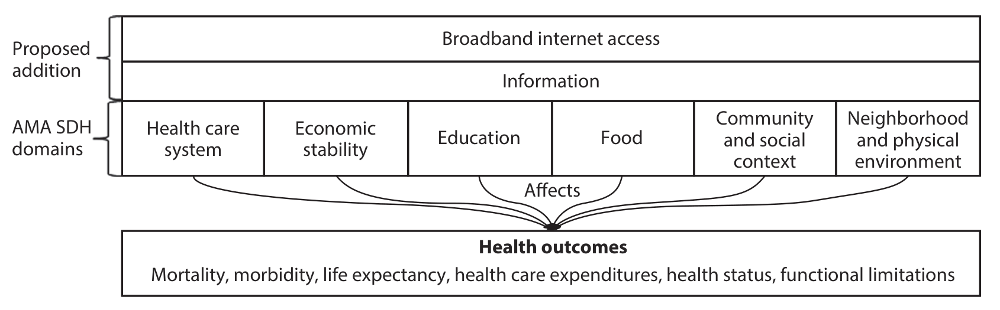

# internet and demo

#### Broadband Internet Access Is a Social Determinant of Health![^3]

<!--State that internet access = information in the digital age-->

Benda et al. (2020) asserts that Broadband Internet Access is a Social Determinant of Health. The paper goes over many circumstances and aspects of daily life that can benefit from Internet access. Especially in the context of the COVID19 pandemic, BIA becomes a direct indicator of the health of a household. 

The healthcare system observed a shift in how consultations are done. The paper notes that the major portion of healthcare consultations require telecommunications systems either for booking, scheduling or for the actual visit. Telehealth saw a boost in popularity and with its ease and effectiveness, Internet access becomes essential, and significantly more so during a pandemic. Those without Internet access will have experienced a non-trivial loss in the quality of the healthcare that they received.

Remote learning has become the main way of learning and consuming academic material for many people. Internet access remains necessary for this medium of education. As education and health have a strong correlation[^1] (among other positive indicators), Internet access ensures an increase in wellbeing throughout populations. 

The Internet has allowed for many communities and groups to take things online. Especially of note are mental health support groups, addiction recovery groups etc. The inherent nature of the Internet allows for these groups to reach more people in need and widen their influence[^2] 

Fig.1—Proposed Extended Model of Social Determinants of Health from Benda et al. (2020) showing how Internet access affects wellbeing

[^1]: Zajacova, A., & Lawrence, E. M. (2018). The Relationship Between Education and Health: Reducing Disparities Through a Contextual Approach. *Annual review of public health*, *39*, 273–289. https://doi.org/10.1146/annurev-publhealth-031816-044628

[^2]: Griffiths, K. M., Mackinnon, A. J., Crisp, D. A., Christensen, H., Bennett, K., & Farrer, L. (2012). The effectiveness of an online support group for members of the community with depression: a randomised controlled trial. *PloS one*, *7*(12), e53244. https://doi.org/10.1371/journal.pone.0053244
[^3]: Benda, N. C., Veinot, T. C., Sieck, C. J., & Ancker, J. S. (2020). Broadband Internet Access Is a Social Determinant of Health!. *American journal of public health*, *110*(8), 1123–1125. https://doi.org/10.2105/AJPH.2020.305784

#### Internet Access and Empowerment[^4]

Internet access is especially important to the disadvantaged. It offers them an opportunity to break out of years-long oppression due to whatever may be the conditions behind it, be it race, caste, gender, economic status among others. By nature, information and education empowers people to take things into their own hands. As the greatest source of information, the Internet offers free education, training, support and many other avenues through which the disadvantaged can be empowered. This report wants to bring to light the paper from Masi et al. (2003) that captured the capacity with which information in the digital age can be used to empower. 

The paper goes about showing this by providing Internet access to particular citizen leaders of a community in West Chicago. The citizen leaders then proceeded to assist family members, neighbours and themselves as well through Internet means—communication via email, accessing community health resources, asking questions via an "Ask-a-doc" program, visiting links that contained information regarding substance abuse, grandparents raising grandchildren etc.

The results were then compared between the intervention group and a comparison group. The numbers showed an overall increase in attitude towards technology and indications that it will be further utilised as well as improved wellbeing.

[^4]: Masi, C. M., Suarez-Balcazar, Y., Cassey, M. Z., Kinney, L., & Piotrowski, Z. H. (2003). Internet access and empowerment: a community-based health initiative. *Journal of general internal medicine*, *18*(7), 525–530. https://doi.org/10.1046/j.1525-1497.2003.20344.x

#### Kerala IT Mission's efforts during floods

In 2018, Many parts of Kerala was hit with severe flooding and. Over 1.3 Million people were affected by the floods. Being one of its worst natural disasters in recent times, many people were left injured and stranded in places with no ways of escape. An effective information exchange system was crucial to rescue efforts and  for those who were yet to be affected as the floods rolled in. Kerala State IT Mission set up a platform that went from ideation to reality within 12 hours[^5]. The platform, keralarescue.in, became a crowdsourced platform where information was exchanged regarding the status of flooding at a granular, local level. More importantly, people who have been stranded, or relatives, friends of them can easily post rescue requests on the platform that were automatically geo-tagged. With the help of this information, the requests were prioritised according to certain parameters by a Machine Learning model. Factors such as the presence of words like "elderly", "children", "injured" were taken into account and rescue attempts were coordinated.

At a big-picture level, the data from this platform was used by the NIRF/Army and other first-responder agencies to calculate which areas are in dire need and where to concentrate resources. The information could be used to generate heat maps, essentially, that led to forces being distributed in a more efficient manner, allowing help to arrive quicker to those that have been affected. 

Other platforms were also set up to help in other issues[^6]. The lack of proper supply chains also led to widespread shortages. Even those that were not directly affected by the floods might find themselves without enough food, water, fuel or other necessities. The system featured real-time mappings of relief camps, rescue efforts and damages. The information was relayed through mostly volunteered information that was delivered through various ICT sources. Documentation of flood related damages, in particular, received concerted efforts from ICT professionals as well with a platform set up to survey affected areas with the help of text, images and geo-tagging.

<!--apa cite these-->

[^5]: https://www.thenewsminute.com/kerala/want-help-keralas-flood-victims-check-out-keralarescuein-86663
[^6]: https://www.expresscomputer.in/egov-watch/how-technology-can-help-india-cope-with-natural-disasters/43603/

### 
